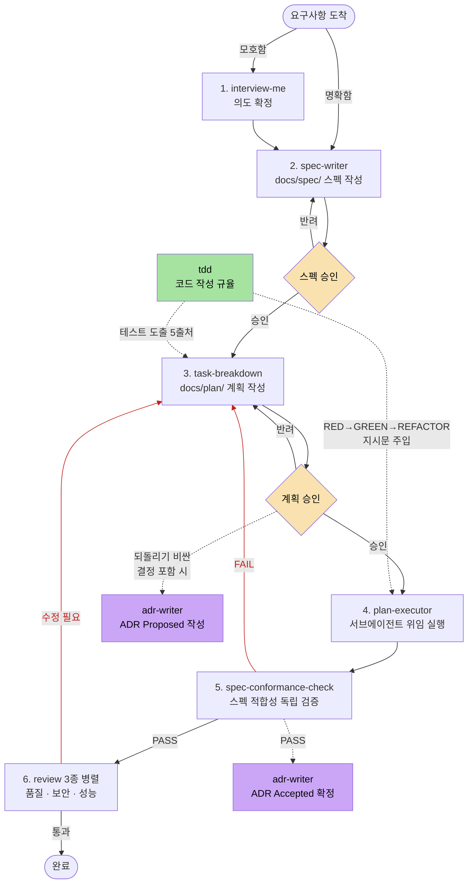

# 에이전틱 개발 워크플로우 스킬 세트

요구사항 수집 → 스펙 → 계획 → 실행 → 검증 → 품질 검토 → 결정 기록을 하나의 환경(Cowork 또는 Claude Code CLI)에서 완결하는 워크플로우와 스킬 모음. 각 단계의 상세 규칙은 해당 스킬의 SKILL.md가 원본이다.

## 설치

이 레포는 Claude Code **플러그인 마켓플레이스**다. 두 가지 설치 경로가 있다.

### 방법 A — 대화형 설치 (처음이면 이걸 권장)

레포를 클론하고 그 안에서 Claude Code를 연 뒤 이렇게 말한다:

```
스킬 설치해줘
```

설치 가이드 스킬([.claude/skills/install-guide](.claude/skills/install-guide/SKILL.md))이 발동해서 MCP 서버 3종 → 스킬 플러그인 2종 순서로 각각의 역할을 설명하고, 필요한 것만 골라 설치해준다.

### 방법 B — 직접 설치

```bash
claude plugin marketplace add nyeonu/skills
```

이후 `/plugin` 메뉴에서 설명을 보고 고르거나, CLI로 직접 설치한다:

```bash
claude plugin install be-workflow@be-agentic-workflow --scope user
```

| 플러그인 | 내용 | 비고 |
|---|---|---|
| `be-workflow` | 워크플로우 코어 스킬 8종 (아래 도식의 파이프라인 전체 + 코드 작성 규율 tdd) | 상호 의존이라 묶음 설치 |
| `be-review` | 리뷰 스킬 3종 + 페르소나 에이전트 2종 | 단독 사용 가능 |
| `mcp-context7` | 라이브러리 최신 문서 조회 MCP | 선택. API 키 불필요 |
| `mcp-atlassian` | Jira·Confluence 원격 MCP | 선택. 첫 사용 시 `/mcp`에서 OAuth 로그인 |
| `mcp-chrome-devtools` | 성능 트레이스 측정 MCP | 선택. 로컬 Chrome 필요 |

MCP 3종은 전부 선택 사항이고, 없어도 스킬들은 동작한다.

## 구조

```
.claude-plugin/marketplace.json    # 마켓플레이스 정의 (플러그인 5종 목록)
.claude/skills/install-guide/      # 대화형 설치 가이드 (레포 안에서만 발동)
plugins/
  be-workflow/skills/
    using-agent-skills/        # 메타 라우터: 진입점 판단 + 공통 운영 규칙
    interview-me/              # [정의] 모호한 요구사항의 의도 추출
    spec-writer/               # [정의] 코드 기반 스펙 문서화
    task-breakdown/            # [계획] 승인된 스펙 → PLAN.md 분해 (기준→테스트→작업 추적성 매핑)
    plan-executor/             # [실행] 계획 실행 오케스트레이션 (tier 기반 고/저비용 분리)
    tdd/                       # [실행] 코드 작성 규율 단일 원본 (테스트 먼저, 도출 5출처)
    spec-conformance-check/    # [검증] 구현물 ↔ 스펙 독립 검증 (fail-fast 게이트)
    adr-writer/                # [기록] ADR 2시점 기록 (Proposed → Accepted)
  be-review/
    skills/
      code-review-and-quality/   # 다축 리뷰: 정확성·가독성·아키텍처 + 보안·성능 1차 확인
      security-and-hardening/    # 보안 (OWASP 기준, 체크리스트 필수 로드)
      performance-optimization/  # 성능 (백엔드 우선, 백엔드/프런트엔드 체크리스트 분리)
    agents/
      code-reviewer.md           # 리뷰 페르소나 (스킬과 동일한 심각도·판정 계약)
      security-auditor.md        # 보안 감사 페르소나
  mcp-context7/ · mcp-atlassian/ · mcp-chrome-devtools/   # MCP 서버 동봉 플러그인
```

## 사용 방법

이 스킬 세트는 절차와 frontmatter 계약 같은 **메커니즘**만 제공한다. 팀 단위로 쓸 때의 **운영 규칙**(공통 스펙을 어느 저장소에 두는지, 티켓 모양, 브랜치, 승인 후 변경 처리)은 각 조직의 운영 문서가 정한다. 아래는 스킬 파이프라인 자체의 사용법이다.

### 실행 순서



노란 마름모 2곳(스펙·계획 승인)만 사람이 개입하는 게이트이고, 나머지 전환은 에이전트 간 자동 연결이다. 보라색은 단계가 아니라 두 시점에 끼어드는 ADR 기록이고, 초록색은 계획(테스트 도출)과 실행(하위 에이전트 지시문)에 주입되는 코드 작성 규율 tdd다.

### 진입점 — 모든 작업이 1번부터 시작하지 않는다

- 요구사항이 모호하다 → 1 (interview-me)
- 요구사항은 명확, 스펙 없음 → 2 (spec-writer)
- 승인된 스펙(`status: approved`) 존재 → 3 (task-breakdown). `implemented`·`superseded` 스펙은 완료된 변경의 기록이라 분해 대상이 아니다
- 승인된 계획 존재 / 실행 중 계획 존재 → 4 (plan-executor, frontmatter `status`로 재개)
- 버그·장애 → 디버깅 후 수정 범위가 크면 3으로 합류
- 사소한 변경(단일 파일, 명확한 범위) → 워크플로우 생략, 직접 처리

진행 상태의 단일 원본은 `docs/spec/`·`docs/plan/` frontmatter의 `status`다. 세션이 끊겨도 문서 상태를 읽으면 중단 지점부터 잇는다.

### 핵심 규칙

1. 승인 게이트 2개(스펙, 계획)는 생략 불가 — 사람이 통제권을 유지하는 장치.
2. 스펙 성공 기준 ↔ 테스트 ↔ 계획 작업 추적성 매핑 필수 (예방) + 5번 독립 검증 (확인). 5번 검증자에게 계획 문서를 주지 않는다.
3. fail-fast: 앞 게이트가 실패하면 뒤 단계 비용이 발생하지 않는다.
4. 계획 밖 병렬 실행은 읽기 전용 작업(검토)에만. 코드 수정은 반드시 계획 루프를 통한다. 승인된 계획 안에서 `depends_on` 없는 작업을 plan-executor가 병렬 실행하는 것은 계획 승인에 포함된 병렬성이다.
5. 단일 환경 진행: 작업 시작 시 Cowork/CLI 중 하나를 정하고 끝까지 그 환경에서. 산출물이 전부 레포 안(`docs/`)이라 다음 작업은 다른 환경에서 시작해도 된다. 요구사항 소스가 외부 채널(기획서·메신저) 중심이면 Cowork, 코드 중심이면 CLI가 유리하다.

### 리뷰 스킬의 참고자료 계약

리뷰 3종의 상세 체크리스트는 각 스킬의 `references/`에 있고, 본문은 판단 규칙만 담는다. 로드는 권고가 아니라 계약이다:

- `security-and-hardening`: 발동 시 `security-checklist.md`를 **항상** 읽고 시작
- `performance-optimization`: 대상 영역별 필수 — 백엔드 작업 → `performance-checklist-backend.md`, UI·브라우저 작업 → `performance-checklist-frontend.md`, 풀스택·불분명 → 둘 다
- `code-review-and-quality`: diff와 작업 목적으로 조건을 판정해 발견 사항 분류 **전에** 해당 체크리스트를 읽고, 출력의 "읽은 참고자료" 슬롯으로 무엇을 읽었는지 드러낸다

외부 공식 기준(OWASP 비밀번호 저장, Core Web Vitals)은 매 작업마다 조회하지 않는다. 각 참고자료의 출처 메타데이터(공식 출처·확인일·출처 버전·상태)에 기록된 값을 쓰고, 월 1회 원본 변경(commit SHA·Last updated)만 감지한다 — 변경이 있으면 자동 수정 없이 `needs_review`로 표시하고 사람이 검토해 갱신한다. 신규 비밀번호 저장 설계, 알고리즘·파라미터 확정, CWV를 스펙·SLA·CI 기준으로 확정하는 작업은 시점과 무관하게 공식 출처를 재확인한다.

## 출처

- addyosmani/agent-skills (MIT): interview-me 원본, spec-writer·task-breakdown·tdd의 방법론, review 3종·페르소나 번역 원문
- 기존 plan-writer/plan-executor/adr-writer: 포맷 계약과 오케스트레이션 구조

원본에서 무엇을 왜 바꿨는지는 [CUSTOMIZATIONS.md](CUSTOMIZATIONS.md)에 기록되어 있다.
