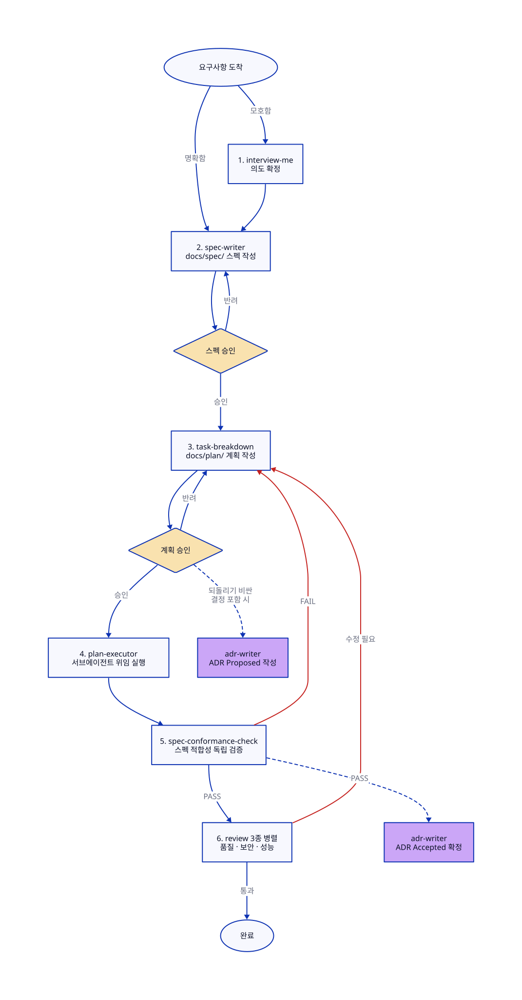

# BE 개발 에이전틱 워크플로우 스킬 세트

요구사항 수집 → 스펙 → 계획 → 실행 → 검증 → 품질 검토 → 결정 기록을 하나의 환경(Cowork 또는 Claude Code CLI)에서 완결하는 워크플로우와 스킬 모음. 각 단계의 상세 규칙은 해당 스킬의 SKILL.md가 원본이다.

## 구조

```
skills/
  define/
    interview-me/            # 모호한 요구사항의 의도 추출
    spec-writer/             # 코드 기반 스펙 문서화
  plan/
    task-breakdown/          # 승인된 스펙 → PLAN.md 분해 (추적성 매핑 포함)
  execute/
    plan-executor/           # 계획 실행 오케스트레이션 (tier 기반 고/저비용 분리)
  verify/
    spec-conformance-check/  # 구현물 ↔ 스펙 독립 검증 (fail-fast 게이트)
  review/
    code-review-and-quality/   # 정확성·가독성·유지보수 (한글 번역)
    security-and-hardening/    # 보안 (한글 번역)
    performance-optimization/  # 성능 (한글 번역)
  record/
    adr-writer/              # ADR 2시점 기록 (Proposed → Accepted)
agents/
  code-reviewer.md           # 리뷰 페르소나 (한글 번역)
  security-auditor.md        # 보안 감사 페르소나 (한글 번역)
```

## 사용 방법

### 실행 순서



노란 마름모 2곳(스펙·계획 승인)만 사람이 개입하는 게이트이고, 나머지 전환은 에이전트 간 자동 연결이다. 보라색은 단계가 아니라 두 시점에 끼어드는 ADR 기록이다. 도식 소스: [docs/workflow.d2](docs/workflow.d2)

### 진입점 — 모든 작업이 1번부터 시작하지 않는다

- 요구사항이 모호하다 → 1 (interview-me)
- 요구사항은 명확, 스펙 없음 → 2 (spec-writer)
- 승인된 스펙 존재 → 3 (task-breakdown)
- 승인된 계획 존재 / 실행 중 계획 존재 → 4 (plan-executor, frontmatter `status`로 재개)
- 버그·장애 → 디버깅 후 수정 범위가 크면 3으로 합류
- 사소한 변경(단일 파일, 명확한 범위) → 워크플로우 생략, 직접 처리

진행 상태의 단일 원본은 `docs/spec/`·`docs/plan/` frontmatter의 `status`다. 세션이 끊겨도 문서 상태를 읽으면 중단 지점부터 잇는다.

### 핵심 규칙

1. 승인 게이트 2개(스펙, 계획)는 생략 불가 — 사람이 통제권을 유지하는 장치.
2. 스펙 성공 기준(SC-N) ↔ 계획 acceptance 추적성 매핑 필수 (예방) + 5번 독립 검증 (확인). 5번 검증자에게 계획 문서를 주지 않는다.
3. fail-fast: 앞 게이트가 실패하면 뒤 단계 비용이 발생하지 않는다.
4. 병렬 실행은 읽기 전용 작업(검토)에만. 코드 수정은 반드시 계획 루프를 통한다.
5. 단일 환경 진행: 작업 시작 시 Cowork/CLI 중 하나를 정하고 끝까지 그 환경에서. 산출물이 전부 레포 안(`docs/`)이라 다음 작업은 다른 환경에서 시작해도 된다. 요구사항 소스가 외부 채널(기획서·메신저) 중심이면 Cowork, 코드 중심이면 CLI가 유리하다.

## 출처

- addyosmani/agent-skills (MIT): interview-me 원본, spec-writer·task-breakdown의 방법론, review 3종·페르소나 번역 원문
- 기존 plan-writer/plan-executor/adr-writer: 포맷 계약과 오케스트레이션 구조

원본에서 무엇을 왜 바꿨는지는 [CUSTOMIZATIONS.md](CUSTOMIZATIONS.md)에 기록되어 있다.

## 미포함 (의도적)

- `workflow-router` (meta 라우팅 스킬): 흐름 안정화 후 도입 예정. 그 전까지는 레포 CLAUDE.md에 "모든 작업은 이 워크플로우의 진입점 판단부터 시작"을 명시해 대체한다.
