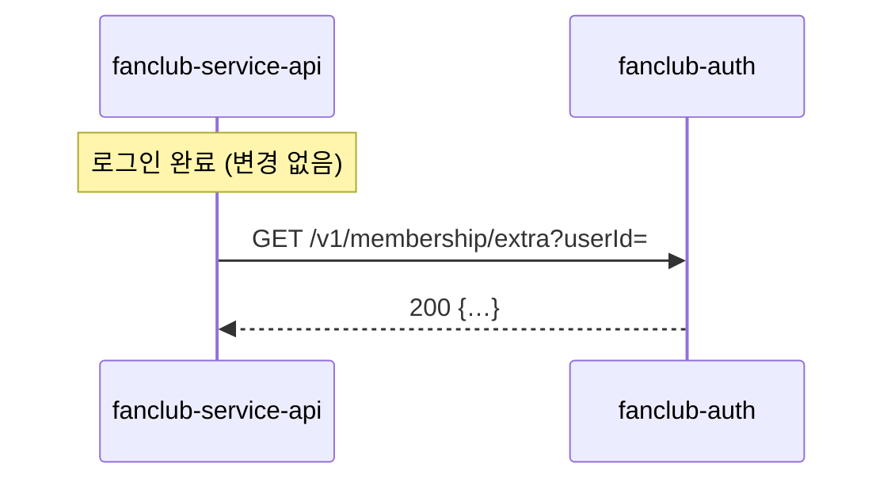
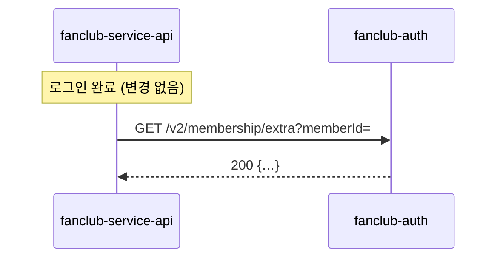

# 스펙 템플릿

frontmatter와 목차 순서, `SC-N` 형식은 고정이다 — 기계 계약이므로 필드 이름과 값 형식을 바꾸지 않는다. 본문 문장과 분량은 작업 크기에 맞게 조절한다. 필수 항목에 쓸 내용이 없으면 일반론으로 채우지 말고 `없음`이라고 쓴다.

이 파일은 **산출물의 모양**만 정한다. scope 결정, 저장 위치와 브랜치, 승인 조건, 승인 후 수정 규칙, status 전이는 spec-writer SKILL.md의 절차를 따른다. 규칙의 배경 설명은 사람용 문서 `docs/team-workflow.md`에 있고, 에이전트는 읽지 않아도 된다.

## scope 요약

| scope | 뜻 | parent | participants | 4절에 채우는 것 |
|---|---|---|---|---|
| `app` (기본) | 애플리케이션 하나가 자기 안에서 할 일 | 공통 스펙의 일부면 필수, 단독 변경이면 없음 | 없음 | 단독이면 `해당 없음`. parent가 있으면 공통 스펙 참조 한 줄 |
| `shared-app` | 여러 애플리케이션이 함께 알아야 하는 것만: 계약, 배포 순서, 통합 SC | 없음 | 필수 | 계약 · 호출 흐름 · 배포 순서 · 계약 변경 절차 |

용어: **애플리케이션**은 따로 배포되고 담당자가 있는 단위(예: fanclub-auth). **저장소**는 git 저장소로, 문서 위치와 브랜치를 말할 때만 쓴다. 링크는 자식 → 부모 한 방향이다. 공통 스펙은 자식 목록을 갖지 않고 `participants`만 갖는다.

## 템플릿

````markdown
---
spec_id: <YYYY-MM-DD-브랜치명-주제-kebab-case>   # shared-app 은 브랜치명 자리에 에픽 티켓 번호. 예: 2026-09-15-ASD-2141-membership-api
title: <스펙 제목>
status: draft                # draft | approved | implemented | superseded. superseded 면 본문 첫 줄에 "대체: <새 spec_id>"
created: <YYYY-MM-DD>
scope: app                   # app | shared-app. 생략하면 app
parent: <공통 스펙 spec_id> @ <저장소>@<통합 브랜치>:<경로>   # 공통 스펙의 일부인 app 스펙만. 예: 2026-09-15-ASD-2141-membership-api @ fanclub-auth@feature/ASD-2141:docs/spec/2026-09-15-ASD-2141-membership-api.md. 해당 없으면 이 줄을 지운다
participants:                # shared-app 만. 작성 시점에 확정하고 이후 고치지 않는다. 해당 없으면 이 블록을 지운다
  - app: <애플리케이션명>
    repo: <저장소>           # 애플리케이션과 같으면 생략
    owner: <담당자>
---

# <기능 또는 변경 이름>

## 1. 한눈에 보기

- 해결할 문제: <지금 무엇이 안 되거나 없는가>
- 바뀌는 결과: <이 작업이 끝나면 누구에게 무엇이 달라지는가>
- 완료 판단: <완료를 무엇으로 판별하는가 — 5의 성공 기준을 한 문장으로>

## 2. 범위

### 포함

- <이번에 하는 것>
- <parent가 있으면: 공통 스펙의 계약에서 이 애플리케이션이 맡는 부분. 예: "새 API 두 개를 제공한다" / "새 API 두 개를 호출하도록 전환한다">

### 제외

- <이번에 명시적으로 하지 않는 것>
- <parent가 있으면: 다른 애플리케이션이 맡는 부분>

## 3. 확인한 사실과 가정

<코드베이스에서 직접 확인한 것과 요구사항에서 추정한 것을 구분한다.>

| 구분 | 내용 | 근거 또는 확인 방법 |
|---|---|---|
| 확인값 | <코드·설정에서 실제 확인한 사실> | <파일 경로, 확인 명령> |
| 추정값 | <확인 못 한 가정. 수치 제안 포함> | <누가 어떻게 확정하는가> |
| 위험값 | <틀리면 설계가 바뀌는 값> | <확인 방법> |
| 깨지는 조건 | <이 스펙이 무효가 되는 전제 변화> | <감지 방법> |

## 4. 계약과 배포 순서

<scope: app, parent 없음 → `해당 없음 (단독 변경)` 한 줄.
scope: app, parent 있음 → `공통 스펙 <위치>의 4절을 따른다` 한 줄. 내용을 복사하지 않는다.
  task-breakdown과 spec-conformance-check는 이 줄을 보고 공통 스펙의 4절을 함께 로드한다.
  아래 "이 애플리케이션 내부 흐름"의 조건에 걸릴 때만 그 소절 하나를 추가한다.
scope: shared-app → 아래 네 소절을 전부 채운다.>

### 계약

<애플리케이션 사이의 약속. 스펙은 요구사항 접수 직후에 쓰므로 새 API는 아직 코드에 없다.
계약의 원본이 무엇인지 팀 방식을 적는다.
- 계약 우선: 손으로 쓴 OpenAPI·proto·스키마 파일을 이 스펙과 함께 커밋. 파일이 원본, 아래 표는 요약.
- 코드 우선(springdoc 등 생성 문서): 구현 전까지 아래 표가 원본. 구현 PR에서 생성 문서를
  파일로 스냅샷 커밋(예: `docs/contract/openapi.json`)하고 "생성 결과 == 파일" 테스트를 붙인다.
  그 뒤로는 파일이 원본이고 spec-conformance-check가 표와 파일을 대조한다.>

- 계약 방식: <계약 우선 | 코드 우선>
- 계약 파일: <계약 우선이면 경로@버전. 코드 우선이면 `구현 PR에서 스냅샷 생성 예정: <경로>`>

| 항목 | 제공 애플리케이션 | 소비 애플리케이션 | 내용 |
|---|---|---|---|
| <예: GET /v2/membership/extra> | <fanclub-auth> | <fanclub-service-api> | <요청 파라미터, 응답 형식, 에러 코드> |
| <예: 기존 GET /v1/... 처리> | <fanclub-auth> | <fanclub-service-api> | <유지 기한 또는 삭제 시점> |

### 호출 흐름 (변경 전/후)

<애플리케이션 경계를 건너는 호출 순서를 변경 전과 후로 나란히. 규칙:
- 바뀌는 경로만 그린다. 바뀌지 않는 앞뒤 구간은 노드 하나로 접는다.
- 노드는 애플리케이션과 API 엔드포인트까지. 내부 클래스·메소드는 그리지 않는다.
- 화살표의 엔드포인트 이름은 위 계약 표와 같게 쓴다.
- Mermaid 텍스트로 쓴다. 그림이 필요 없는 계약이면 `해당 없음`.>

**변경 전**



**변경 후**



### 이 애플리케이션 내부 흐름

<parent가 있는 app 스펙에서, 아래 넷 중 하나에 걸릴 때만 이 소절을 만든다. 아니면 만들지 않는다.
- 상태 전이가 있다 (전이마다 허용 동작이 다름)
- 비동기·이벤트가 끼어 있다
- 캐시 갱신 순서가 정확성을 결정한다
- 트랜잭션 경계가 메소드 여럿에 걸친다
수준은 컴포넌트까지. 상태 전이면 stateDiagram, 나머지는 sequenceDiagram 또는 flowchart. Mermaid 텍스트.>

### 배포 순서

<어느 애플리케이션이 먼저 배포되어야 하고, 그 사이 기간에 시스템이 어떻게 동작해야 하는지.
예: "fanclub-auth 먼저. 전환 완료까지 기존 API 유지. fanclub-service-api 배포 후 기존 API 제거는 별도 작업.">

### 계약 변경 절차

<기본값은 spec-writer SKILL.md "승인된 스펙의 수정"의 L0·L1·L2 등급이다. 팀이 다르게 정한 것만 적는다.
없으면 `기본값을 따른다`.>

## 5. 성공 기준

<완료를 판별하는 구체적·검증 가능한 조건. 각 항목에 SC-1, SC-2… ID를 붙인다.
ID는 이 문서 안에서 유일하다. 다른 스펙의 SC는 `<spec_id>#SC-N`으로 가리킨다.
이 ID는 task-breakdown의 추적성 매핑과 spec-conformance-check의 검증 단위다.
각 SC는 테스트로 옮길 수 있는 형태로 쓴다 (tdd 스킬 출처 ①).
scope: shared-app 이면 통합 성공 기준만 적는다 — 애플리케이션 둘 이상이 함께 배포된 뒤에야
확인되는 조건. 애플리케이션 하나 안에서 확인되는 조건은 그 애플리케이션 스펙의 SC다.
통합 SC는 검증 담당을 반드시 적는다.>

- SC-1: <주어진 상태 또는 입력 → 기대 결과>
- SC-2: <주어진 상태 또는 입력 → 기대 결과>

<scope: shared-app 전용>
| 통합 SC | 검증 담당 | 검증 시점 |
|---|---|---|
| SC-1 | <담당자> | <예: 두 애플리케이션 스테이징 배포 후> |

## 6. 제약과 경계

- 지켜야 할 조건: <예: 기존 네이밍 컨벤션 준수, 커밋 전 테스트>
- 사용자 확인이 필요한 변경: <예: DB 스키마 변경, 의존성 추가>
- 하지 않을 것: <예: 기존 API 시그니처 변경, 무관한 리팩토링>

## 7. 미해결 사항

- <사람의 입력이 필요한 미결 사항. 없으면 "없음">
````

## 작성 시 체크리스트

- [ ] frontmatter가 scope에 맞는가 — `app`은 `participants` 없음, `shared-app`은 `parent` 없음과 `participants` 필수
- [ ] `parent`가 있으면 `<spec_id> @ <저장소>@<브랜치>:<경로>` 형식이고 실제 존재하는 파일을 가리키는가
- [ ] 4절이 scope에 맞는가 — 단독 app은 `해당 없음`, parent 있는 app은 참조 한 줄(+조건 시 내부 흐름), shared-app은 네 소절 전부
- [ ] 계약 내용이 공통 스펙 한 곳에만 있고 애플리케이션 스펙에 복사되지 않았는가
- [ ] `shared-app`이면 계약 방식과 계약 파일 항목이 채워졌는가
- [ ] 호출 흐름이 바뀌는 경로만, 애플리케이션·엔드포인트 수준까지만이고, 엔드포인트 이름이 계약 표와 같은가
- [ ] 내부 흐름을 그렸다면 네 조건 중 어디에 걸리는지 말할 수 있는가
- [ ] `shared-app`의 SC가 통합 조건만 담고 있고 각 SC에 검증 담당이 있는가
- [ ] SC ID가 이 문서 안에서 유일하고, 다른 스펙의 SC는 `<spec_id>#SC-N`으로 가리켰는가
- [ ] 빈 필수 항목을 일반론으로 채우지 않고 `없음`으로 뒀는가
